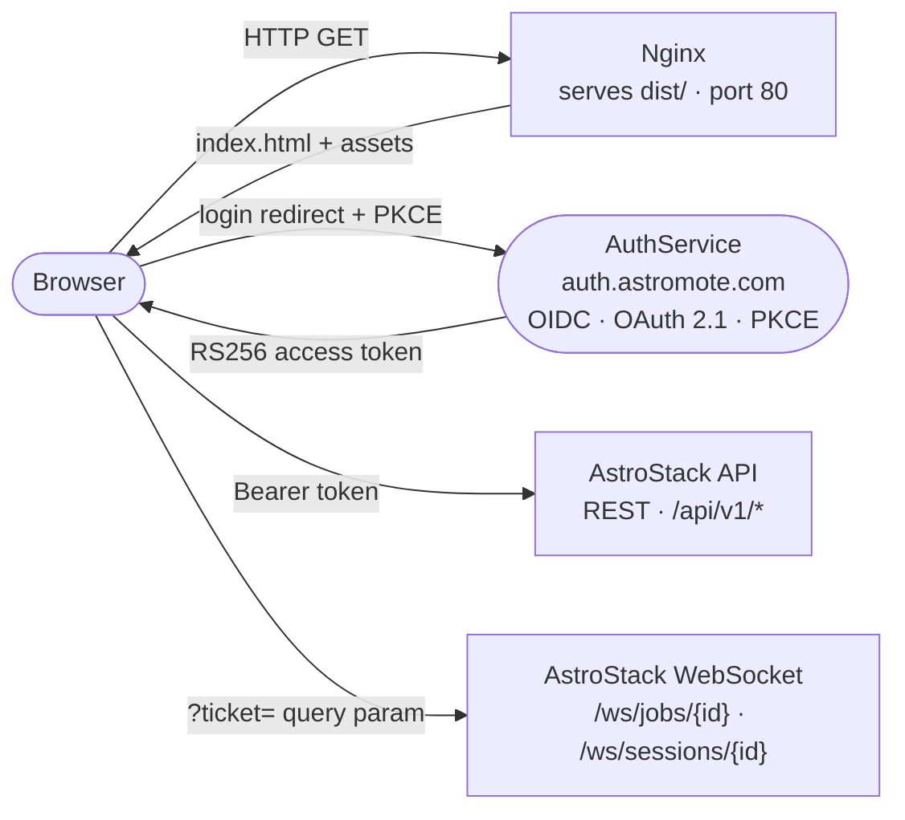

# AstroUI

[](./LICENSE)
[](https://react.dev/)
[](https://vitejs.dev/)
[](https://github.com/x42en/astro-ui/pkgs/container/astro-ui)
[](https://github.com/x42en/astro-ui/actions/workflows/docker-publish.yml)

> Web interface for the [AstroStack](https://github.com/x42en/astro-stack)
> astrophotography processing pipeline.

AstroUI is a React single-page application that connects to the AstroStack
backend API. It lets visitors discover and browse a public gallery of community
results, and lets signed-in astronomers create processing sessions, upload
calibration frames, monitor pipeline progress in real time over WebSocket,
inspect EXIF and pipeline metadata of every result, and share their profiles
with the community.

---

## Overview

| Component | Stack |
|---|---|
| Framework | React 18 + TypeScript (strict mode) |
| Build tool | Vite 5 |
| Routing | React Router v7 |
| State | Zustand (with `localStorage` persistence) |
| Data fetching | TanStack Query v5 + Axios |
| Authentication | oidc-client-ts · AuthService (OAuth 2.1 + PKCE · RS256) |
| UI primitives | Radix UI (dialog, dropdown, progress, select, switch, tooltip) |
| Styling | Tailwind CSS v3 |
| Icons | Lucide React |
| Charts | Recharts |
| Internationalization | i18next (English / French) |
| Container | Nginx 1.27 Alpine |

---

## Features

- **Public landing page** with a hero, capability cards, community teaser, a
  live gallery carousel, and an honest roadmap.
- **Public gallery** — anonymous browsing of published sessions with a
  full-screen lightbox; signed-in users can publish their own.
- **OAuth 2.1 / OIDC authentication** — production sign-in redirects to
  [AuthService](https://auth.astromote.com) (Authorization Code + PKCE, RS256
  JWTs). A `mock` mode is available for staging (HS256, `X-Mock-User` header).
  Role-based route guards enforce access to admin-only pages.
- **Sessions dashboard** — create sessions, drag-and-drop calibration frames,
  pick a preset, launch the pipeline. Live sessions are flagged with a
  pulsing **Live** badge and clicking one jumps straight back into the
  real-time view.
- **Live session view** — real-time stack preview, per-frame statistics
  (median R/G/B, FWHM, clipping) and a **recommendations panel** that surfaces
  prioritised exposure, white-balance and focus advice while you are still at
  the telescope. A persistent banner lets you resume the active live session
  from any page.
- **Calibration dropzones** — dedicated upload areas for darks, flats and
  dark-flats with progress, current counts and contextual hints; reachable
  from the live-session terminate flow and from any session detail page.
- **Session preparation** — pick an observation site, browse curated celestial
  objects, score upcoming nights by weather window (cloud cover, seeing, Moon
  phase) and create a session pre-wired to a target.
- **Real-time progress** — WebSocket-powered step-by-step view with logs,
  percentages, and per-step status.
- **Detailed, customizable pipelines** — profile editor with object presets
  (Orion, M31, Galactic Center, …) and granular control over every pipeline
  parameter, including denoise engine, sharpening and super-resolution.
- **Profile import / export / sharing** — JSON round-trip, one-click import,
  one-toggle publication.
- **Metadata cartouche** — discreet, collapsible overlay showing EXIF
  (camera, ISO, exposure, focal length, integration) and the pipeline used to
  produce each result.
- **Adaptive-critic reasoning trace** — when AstroStack's optional vision
  critic is enabled, a collapsible panel shows what it changed and why, per
  refined step, once a result is ready.
- **Adaptive-overrides panel** — surfaces any object-type-driven profile
  adjustments the backend applied automatically before processing started.
- **Internationalization** — English and French, with automatic browser
  language detection.
- **Branded identity** — bespoke telescope logo (favicon, header, login
  screen, empty states, gallery cartouche).
- **Runtime configuration** — change API/WebSocket URLs, retry budgets, and
  defaults from the Settings page; values persist in `localStorage`.

---

## Architecture



### Routes

| Path | Access | Description |
|---|---|---|
| `/` | Public / Authed | Smart redirect: anonymous → Landing; authed → Dashboard. |
| `/welcome` | Public | Landing page, always reachable. |
| `/login` | Public | OIDC sign-in — initiates Authorization Code + PKCE redirect. |
| `/auth/callback` | Public | OAuth 2.1 redirect callback — completes token exchange. |
| `/gallery` | Public | Community gallery + lightbox. |
| `/history` | Authed | Personal sessions dashboard. |
| `/sessions/:id` | Authed | Session detail, processing, output. |
| `/sessions/:id/live` | Authed | Live stacking view with stats and recommendations. |
| `/prepare` | Authed | Session prep — weather window + target picker. |
| `/profiles` | Authed | Profile editor + import/export. |
| `/settings` | Admin | Runtime configuration (admin-only). |

### Source layout

| Layer | Directory | Responsibility |
|---|---|---|
| Types | `src/types/` | Shared interfaces and aliases. |
| Services | `src/services/` | REST calls (Axios). |
| Stores | `src/store/` | Zustand stores (settings, UI, auth). |
| Hooks | `src/hooks/` | Reusable React side effects (uploads, WebSocket). |
| Lib | `src/lib/` | Pure utilities (axios client, presets, query client). |
| Components | `src/components/` | Branding, auth guards, layout, gallery, landing, processing, profiles, sessions, UI primitives. |
| Pages | `src/pages/` | Route-level views. |

---

## Quick Start

### With Docker

```bash
docker pull ghcr.io/x42en/astro-ui:latest

docker run -d --name astro-ui -p 3000:80 \
  ghcr.io/x42en/astro-ui:latest
```

Open `http://localhost:3000`. Use the Settings page to point the UI at your
running AstroStack backend.

### With the AstroStack compose stack

`VITE_*` variables are baked into the JavaScript bundle at compile time.
The pre-built image ships with sensible defaults (`/api/v1` relative URL,
`AUTH_MODE=oidc`, `OIDC_AUTHORITY=https://auth.astromote.com`) that work
out-of-the-box behind Traefik. Add the service to the backend's
`docker-compose.yml`:

```yaml
services:
  astro-ui:
    image: ghcr.io/x42en/astro-ui:latest
    restart: unless-stopped
    ports:
      - "3000:80"
    depends_on:
      - astro-api
    labels:
      - "traefik.enable=true"
      - "traefik.http.routers.astro-ui.rule=Host(`ui.${TRAEFIK_HOST}`)"
      - "traefik.http.routers.astro-ui.entrypoints=websecure"
      - "traefik.http.routers.astro-ui.tls.certresolver=letsencrypt"
      - "traefik.http.services.astro-ui.loadbalancer.server.port=80"
```

```bash
docker compose up -d astro-ui
```

---

## Configuration

### Build-time variables

These are baked into the JavaScript bundle. They set the **defaults** shown in
the Settings page; users can override them at runtime.

| Variable | Default | Description |
|---|---|---|
| `VITE_API_BASE_URL` | `/api/v1` | REST API root URL. Relative paths route via Traefik. |
| `VITE_WS_BASE_URL` | *(derived from page origin)* | WebSocket endpoint for live job progress. |
| `VITE_AUTH_MODE` | `oidc` | Auth mode: `oidc` (prod), `mock` (staging), `disabled` (dev). |
| `VITE_OIDC_AUTHORITY` | `https://auth.astromote.com` | OIDC issuer base URL. |
| `VITE_OIDC_CLIENT_ID` | `astrostack` | OAuth 2.1 client identifier. |
| `VITE_SUPABASE_URL` | *(empty)* | Supabase project URL (only if Supabase is used). |
| `VITE_SUPABASE_ANON_KEY` | *(empty)* | Supabase anonymous key (only if Supabase is used). |

```bash
docker build \
  --build-arg VITE_API_BASE_URL=https://api.example.com/api/v1 \
  --build-arg VITE_WS_BASE_URL=wss://api.example.com/ws \
  --build-arg VITE_AUTH_MODE=oidc \
  --build-arg VITE_OIDC_AUTHORITY=https://auth.astromote.com \
  --build-arg VITE_OIDC_CLIENT_ID=astrostack \
  -t astro-ui:local .
```

### Runtime settings (Settings page, admin only)

| Setting | Default | Description |
|---|---|---|
| **API Base URL** | `VITE_API_BASE_URL` | REST API root URL. |
| **WebSocket URL** | `VITE_WS_BASE_URL` | Live-progress endpoint. |
| **Inbox Path** | `/data/inbox` | Informational — must match the backend's `INBOX_PATH`. |
| **Ollama URL** | `http://localhost:11434` | Informational — must match the backend's `OLLAMA_URL`. |
| **Max retries** | `3` | Default per-step retry budget. |
| **Session stability delay** | `5 s` | Seconds to wait after the last file change before launching the pipeline. |

Values are persisted to `localStorage`.

---

## Usage

### Browse the public gallery

The landing page (`/`) showcases a live carousel of recently published
sessions; the full grid lives at `/gallery`. Both are accessible without an
account. Anonymous visitors can request a one-time download by email.

### Sign in

Navigate to `/login` and click **Sign in with Astromote**. You will be
redirected to [auth.astromote.com](https://auth.astromote.com) to authenticate
via OAuth 2.1 + PKCE. After a successful login you are redirected back to the
application. Users with the `admin` role automatically gain access to the
Settings page.

### Create and run a session

1. From the dashboard, click **New Session** and provide a name plus an
   optional object (e.g. `M31 Andromeda`).
2. Drag-and-drop FITS / RAW frames into the lights / darks / flats / bias
   slots. Lights are mandatory.
3. Pick a preset (`Quick`, `Standard`, `Quality`) or a custom profile.
4. Watch the per-step progress, log lines, and final outputs stream in.

### Manage processing profiles

Open `/profiles` to create, edit, import, export, and publish profiles. Sharing
a profile publishes it to the community; other users can import it in one
click.

### Inspect a result

Open any session in the gallery or in your history. The metadata cartouche
overlay surfaces the camera, ISO, exposure, focal length, integration time,
plus the exact pipeline that produced the image. The cartouche starts
collapsed so it never hides the photo.

---

## Roadmap

The following items are planned but not yet implemented. They are listed in
priority order; the order may change based on feedback.

1. **Reference-image search** for AstroStack's adaptive critic — opt-in,
   disabled by default; results would be surfaced here as stylistic context
   alongside the critic's reasoning trace.
2. **Planet-dedicated processing pipeline** with lucky-imaging support.
3. **Observation time-slot suggestions** after selecting a celestial object and
   a location.
4. **AI-driven session scheduling** and observation recommendations based on
   weather forecast, location, and target.
5. **Pipeline tools and steps exposed as MCP servers** so external agents can
   compose them.
6. **Observation alerts** (cancel reminders for cloudy nights, favourite-target
   visibility windows, etc.).

> AstroStack's pipeline already features an adaptive vision-critic loop
> (off by default) that auto-selects and auto-improves its own configuration
> — see the backend's README for details.

---

## Development

See [DEVELOPMENT.md](./DEVELOPMENT.md) for the full development guide
(architecture, local setup, testing, common workflows) and the shared coding
principles that apply to every change.

Quick reference:

```bash
git clone https://github.com/x42en/astro-ui.git
cd astro-ui
cp .env.example .env
npm install
npm run dev               # http://localhost:5173 with HMR

npm run typecheck         # tsc --noEmit
npm run lint              # ESLint
npm run build             # Production bundle to dist/
npm run preview           # Serve dist/ locally
```

---

## Contributing

See [CONTRIBUTING.md](./CONTRIBUTING.md) for the workflow, commit-message
conventions, and review process.

---

## License

| Component                | License |
| ------------------------- | ------- |
| AstroUI (this project)    | GPL-3.0-or-later |
| React / React DOM         | MIT     |
| Vite                      | MIT     |
| Tailwind CSS               | MIT     |
| Radix UI                  | MIT     |
| TanStack Query             | MIT     |
| Zustand                   | MIT     |
| Lucide React               | ISC     |
| oidc-client-ts             | Apache-2.0 |
| Nginx                     | BSD-2-Clause |
| AstroStack (backend, separate project) | GPL-3.0-or-later |
